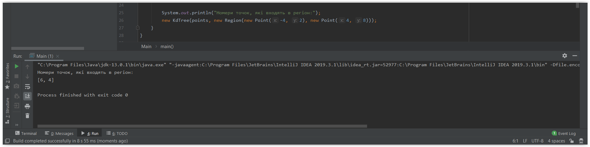
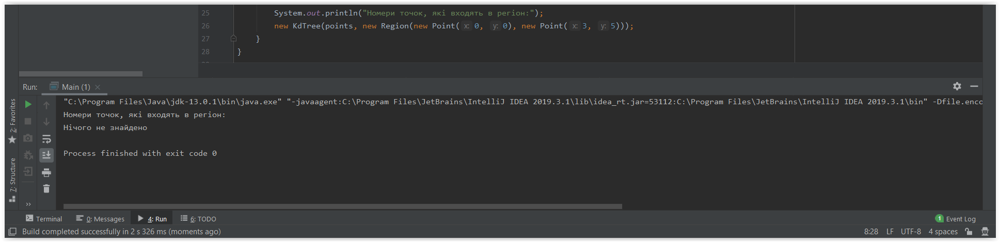

## Приклади виконання програми

#### Як виглядає граф можна знайти у файлі [graphVisualization.txt](graphVisualization.txt)
- Регіон: нижня ліва точка - (-4, 2), верхня права точка - (4, 8) 
  
- Регіон: нижня ліва точка - (0, 0), верхня права точка - (3, 5) 
  

